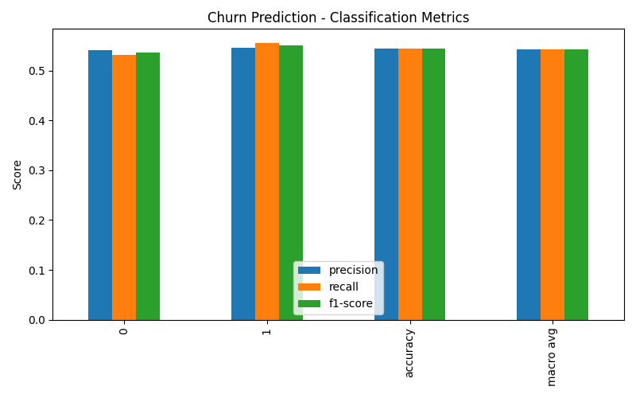
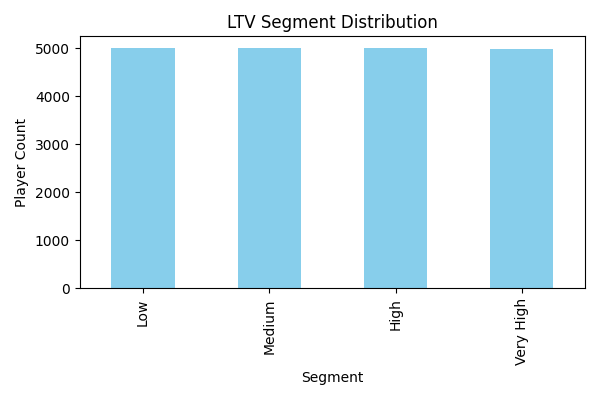
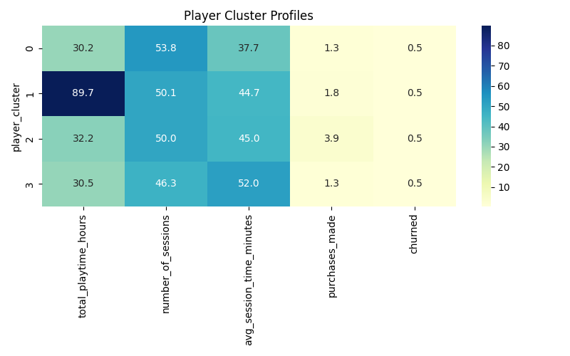

# Player Analytics & Churn Prediction Project

This project is a self-initiated, end-to-end **data science case study** built to simulate how gaming companies like **Electronic Arts (EA)** analyze player behavior. It demonstrates how large-scale behavioral data can be leveraged to drive insights around engagement, churn, lifetime value, and player segmentation using Python, machine learning, and data visualization.

---

## Objectives

- Simulate a realistic player dataset with **2 million entries**
- Predict player churn using **supervised ML (Random Forest)**
- Estimate **Lifetime Value (LTV)** and segment users
- Analyze **engagement patterns** by churn behavior
- Simulate **funnel drop-offs** in a monetization journey
- Use **KMeans clustering** to segment player types
- Build **visualizations** to communicate results effectively

This project was developed to strengthen my understanding of real-world analytics and machine learning workflows and is tailored to be **employer-friendly** for roles in data science and analytics.

---

## Dataset Overview

| Column | Description |
|--------|-------------|
| `player_id` | Unique player identifier |
| `total_playtime_hours` | Total gameplay time in hours |
| `number_of_sessions` | Number of distinct gaming sessions |
| `avg_session_time_minutes` | Average time spent per session |
| `purchases_made` | Count of in-game purchases |
| `level_achieved` | Max level reached in game |
| `days_since_last_login` | Recency of activity (in days) |
| `churned` | Target variable (0 = active, 1 = churned) |

All data is **synthetically generated** using statistical distributions to reflect real-world gaming patterns.

---

## Key Insights

1. **Churn Prediction:** Using Random Forest, we predict which players are likely to leave the game.
2. **LTV Segmentation:** Players are grouped into Low, Medium, High, and Very High segments based on predicted value.
3. **Engagement Analysis:** Compare behavior (sessions, session time) between churned and retained users.
4. **Funnel Drop-off Simulation:** Identify drop-off points between viewing content, browsing store, and retention.
5. **Player Clustering:** Behavioral segmentation using KMeans into distinct player personas.

---

### Prerequisites
- Python 3.7+
- `pandas`, `numpy`, `matplotlib`, `seaborn`, `scikit-learn`

### Installation

```bash
pip install -r requirements.txt
```

### Execute

```bash
python analyze_and_visualize_players.py
```

This script will:
- Load the `player_data.csv`
- Generate all insight CSVs
- Create visualizations in `player_insights/plots/`

---

##  Tools & Technologies

- Python (pandas, numpy, matplotlib, seaborn, scikit-learn)
- Jupyter Notebook (optional for EDA)
- Git + GitHub for version control and sharing

---

##  Sample Visualizations

<p float="left">
  
  
  
</p>

---

##  About This Project

This project was created as part of my **self-learning journey** to strengthen core data science and analytics skills. It’s designed to simulate real-world challenges that data scientists face in digital product and gaming companies — particularly in understanding **user behavior, segmentation, and retention**.

---

## 👤 About Me

I'm **Priyanka S. Shinde**, a data science enthusiast with a background in healthcare analytics, passionate about applying data to drive impact across any industry.

📫 Reach me on [LinkedIn](https://www.linkedin.com/)  
📧 Email: priyankashinde160321@gmail.com

---

## License

This project is licensed under the MIT License — feel free to use, fork, or contribute!
